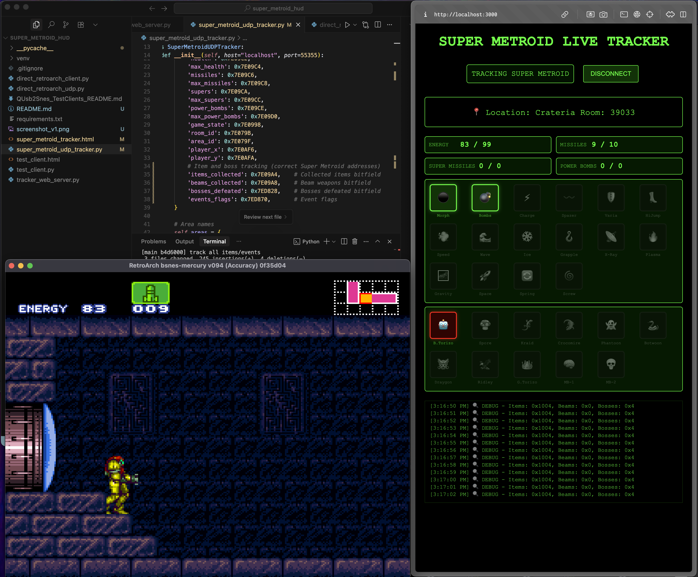

# 🚀 Super Metroid Live Tracker



A **real-time overlay tracker** for Super Metroid that displays live game stats, items, and boss progress directly from RetroArch. Perfect for speedruns, casual play, or streaming!

## ✨ Features

### 📊 **Real-Time Stats**
- **Energy/Health** with current/max display
- **Missiles, Super Missiles, Power Bombs** counts
- **Location tracking** (Area + Room ID)
- **Live updates** every second

### 🎮 **Item & Boss Tracking**
- **16 Major Items** - Morph Ball, Bombs, Varia Suit, Speed Booster, etc.
- **11 Boss Battles** - Kraid, Ridley, Mother Brain, etc.
- **Visual indicators** - Items glow green when obtained, bosses glow red when defeated
- **Grayed out uncollected items** for clear visual status

### 🎨 **Overlay-Friendly Design**
- **Compact layout** optimized for streaming overlays
- **Retro terminal aesthetic** with green Matrix-style theme
- **Responsive grid layout** that adapts to different screen sizes
- **Clean emojis** for instant visual recognition

## 🏗️ Architecture

```
Super Metroid (RetroArch) 
    ↓ UDP (port 55355)
Python UDP Tracker ─→ Web Server (port 3000)
    ↓ HTTP JSON API
HTML Live Tracker (Browser)
```

### 🔧 **Why UDP Direct Connection?**

We **bypass QUsb2Snes entirely** and connect directly to RetroArch via UDP because:
- ✅ **No "trusted origin" security issues**
- ✅ **Faster response times** (no middleware)
- ✅ **More reliable** (fewer connection drops)
- ✅ **Simpler setup** (one less dependency)

## 🚀 Quick Start

### Prerequisites
- **RetroArch** with Super Metroid loaded
- **Python 3.7+** with pip
- **Network commands enabled** in RetroArch

### 1. Setup RetroArch
Ensure your `retroarch.cfg` has:
```ini
network_cmd_enable = "true"
network_cmd_port = "55355"
```

### 2. Install Dependencies
```bash
pip install -r requirements.txt
```

### 3. Start the Tracker
```bash
python tracker_web_server.py
```

### 4. Open in Browser
Navigate to: **http://localhost:3000/**

### 5. Connect & Track!
Click **CONNECT** and start playing! The tracker will automatically detect when Super Metroid is loaded.

## 📁 Project Structure

```
super_metroid_hud/
├── super_metroid_tracker.html      # Main tracker interface
├── super_metroid_udp_tracker.py    # UDP client for RetroArch
├── tracker_web_server.py           # HTTP server bridge
├── requirements.txt                # Python dependencies
├── test_client.html                # Debug WebSocket client
├── test_client.py                  # Debug Python client
├── direct_retroarch_udp.py         # UDP testing client
└── QUsb2Snes_TestClients_README.md # Original troubleshooting docs
```

## 🛠️ Technical Details

### Memory Addresses (Super Metroid SNES)
```javascript
Health:        0x7E09C2  // Current health (2 bytes)
Max Health:    0x7E09C4  // Maximum health (2 bytes) 
Missiles:      0x7E09C6  // Current missiles (2 bytes)
Area ID:       0x7E079F  // Current area (1 byte)
Room ID:       0x7E079B  // Current room (2 bytes)
Items:         0x7E09A4  // Item bitfield (2 bytes)
Bosses:        0x7ED828  // Boss bitfield (2 bytes)
```

### API Endpoints
- `GET /` - Main tracker interface
- `GET /api/status` - Full game status + connection info
- `GET /api/stats` - Live game statistics only

### RetroArch UDP Commands
```
VERSION                          # Get RetroArch version
GET_STATUS                       # Get core + game info  
READ_CORE_MEMORY 0x7E09C2 16    # Read 16 bytes from address
```

## 🎯 Development Journey

### Original Challenge
Started with **QUsb2Snes WebSocket** connection but encountered:
- `"Not in trusted origin"` security errors
- Connection instability  
- Browser CORS restrictions

### Solution Evolution
1. **QUsb2Snes WebSocket** ❌ (Security issues)
2. **Direct RetroArch TCP** ❌ (Wrong protocol)
3. **Direct RetroArch UDP** ✅ (Perfect!)

### Key Breakthroughs
- Discovered RetroArch uses **UDP** not TCP on port 55355
- Found the correct **Super Metroid memory layout**
- Built **HTTP bridge** for browser compatibility
- Optimized for **overlay streaming** use

## 🎮 Supported Features

### Items Tracked
- **Movement**: Morph Ball, Bombs, Hi-Jump, Speed Booster, Space Jump
- **Suits**: Varia Suit, Gravity Suit  
- **Beams**: Charge, Ice, Wave, Spazer, Plasma
- **Tools**: Grappling Beam, X-Ray Scope, Spring Ball, Screw Attack

### Bosses Tracked  
- **Crateria**: Bomb Torizo
- **Brinstar**: Spore Spawn, Kraid
- **Norfair**: Crocomire, Golden Torizo
- **Wrecked Ship**: Phantoon
- **Maridia**: Botwoon, Draygon  
- **Tourian**: Ridley, Mother Brain (Phase 1 & 2)

## 🔧 Troubleshooting

### RetroArch Not Detected
```bash
# Check if RetroArch UDP port is open
lsof -i :55355

# Should show RetroArch process using UDP
```

### Game Not Loading
- Ensure Super Metroid ROM is loaded and **actively playing**
- Check RetroArch core compatibility (bsnes-mercury works best)
- Verify `network_cmd_enable = "true"` in retroarch.cfg

### Connection Issues
- Make sure **both RetroArch and tracker server** are running
- Check firewall isn't blocking port 55355 or 3000
- Try refreshing browser if connection seems stuck

## 🎨 Customization

### Modify Update Rate
```python
# In tracker_web_server.py, change polling interval
updateInterval = setInterval(updateStats, 500);  # 500ms = 2x per second
```

### Add Custom Items
```python
# In super_metroid_udp_tracker.py
self.item_bits = {
    'my_item': 0x80,  # Add custom item with bit flag
    # ... existing items
}
```

### Style Changes
Edit CSS in `super_metroid_tracker.html` to customize:
- Colors and themes
- Grid layouts
- Font sizes and spacing
- Animation effects

## 🚀 Future Enhancements

- [ ] **Energy Tank count** tracking
- [ ] **Missile expansion** tracking  
- [ ] **Completion percentage** calculation
- [ ] **Time tracking** for speedruns
- [ ] **Multiple game support** (ALttP, etc.)
- [ ] **Sound alerts** for item collection
- [ ] **Twitch integration** for viewer commands

## 📜 License

MIT License - Feel free to fork, modify, and share!

## 🙏 Acknowledgments

- **RetroArch team** for the excellent emulator and UDP interface
- **Super Metroid community** for memory mapping documentation  
- **QUsb2Snes project** for inspiration (even though we ended up bypassing it!)

---

**Happy bounty hunting, space pirates!** 🚀👾 