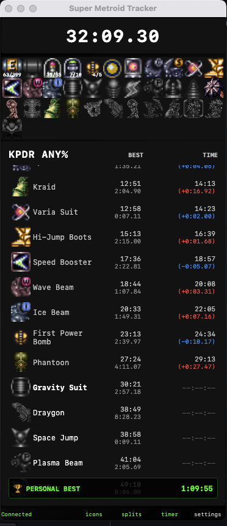
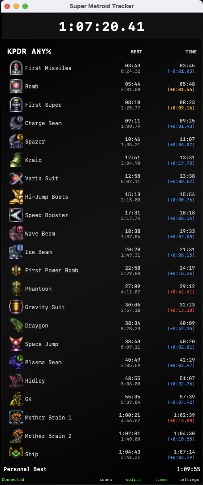
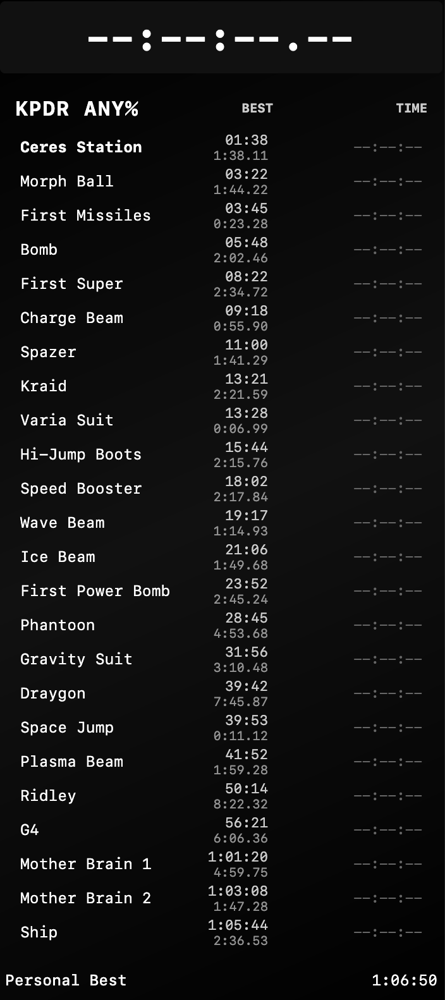

# Super Metroid Auto Tracker

A real-time item, boss, and location tracker for Super Metroid with automatic speedrun splits. Supports multiple connection methods including RetroArch Network Commands and SNI (SNES Classic/SD2SNES).

<!-- Icons Only View -->
<div align="left">
  
  
</div>

<!-- Splits Views -->
<div align="left">
  
  
  
</div>

<!-- Settings Views -->
<div align="left">
  
  
  
</div>

## ✨ Features

- **Multi-Platform Support**: Works with RetroArch (any platform) and SNI-compatible devices (SD2SNES, SNES Classic, etc.)
- **Automatic Item & Boss Tracking**: Real-time detection of all items, beams, suits, and boss defeats
- **Auto-Splits**: Automatic speedrun splits for KPDR Any% route with best possible time calculation
- **Customizable UI**: 
  - Adjustable icon sizes (16x16 to 256x256)
  - Multiple themes (Dark, Light, Matrix Green, etc.)
  - Show/hide individual icons
  - Configurable split display modes (icons, names, or both)
- **Room Name Display**: Shows current area and room name
- **Run Statistics**: Personal best tracking with best possible time derived from best segments across all runs
- **Persistent Storage**: All settings, icon configurations, and run history saved to `~/.smtracker/`

## 🚀 Installation

### Prerequisites
- Java 11 or higher
- One of the following:
  - **RetroArch** with network commands enabled, OR
  - **SNI** with a compatible device (SD2SNES, SNES Classic, etc.)

### RetroArch Configuration
1. In RetroArch, go to Settings → Network
2. Enable "Network Commands" (set to ON)
3. Keep the default port (55355) or note your custom port for configuration

### SNI Configuration
1. Download and run [SNI](https://github.com/alttpo/sni) (default port: 8191)
2. Connect your SD2SNES or SNES Classic device
3. Load Super Metroid
4. The tracker will automatically detect and connect to SNI


## 🎯 Usage

### Basic Operation
1. Start RetroArch (or SNI) and load Super Metroid
2. Launch Super Metroid Auto Tracker
3. The application will automatically detect and connect to the best available connection method
4. Start playing - items and bosses will be tracked automatically!

### Keyboard Shortcuts
- **Spacebar**: Start/pause the run timer
- **R**: Reset the current run (requires confirmation)

### UI Controls
- **Bottom Navigation**: Toggle between different views
  - **icons**: Item and boss status grid
  - **splits**: Speedrun splits with auto-detection
  - **timer**: Standalone run timer
  - **settings**: Customize themes, icon sizes, and more

### Settings Panel
- **Theme Selection**: Choose from multiple color schemes
- **Icon Size**: Adjust main icon grid size (16x16 to 256x256)
- **Split Icon Size**: Separate size control for split icons
- **Split Display Mode**: Show icons, names, or both in splits view
- **Room Name Display**: Toggle current room name visibility
- **Icon Management**: Show/hide individual icons and reorder them


## 🧪 Building and Testing

### Building from Source
1. Clone the repository
2. Build and run the application with a single command:
   ```
   ./gradlew build && ./gradlew run
   ```
   
   Or build and run separately:
   ```
   ./gradlew build
   ./gradlew run
   ```
3. Create a distribution package:
   ```
   ./gradlew packageDistributionForCurrentOS
   ```
   
### Creating a macOS App Bundle with Packaged JRE
To create a macOS .app bundle with a packaged JRE:
1. Run the following command:
   ```
   ./gradlew packageDmg
   ```
2. This will create a .dmg file in the `build/compose/binaries/main/dmg/` directory
3. Open the .dmg file and drag the application to your Applications folder
4. The app will include a bundled JRE, so it will run without requiring Java to be installed

### Testing
Run the tests with:
```
./gradlew test
```

The project includes tests for:
- Auto-splits logic
- Game state parsing
- Memory reading stability


## 🔍 How It Works

### Connection Methods
The tracker supports multiple connection methods and automatically detects the best available option:

1. **SNI (SNES Network Access)** - Preferred method
   - Connects to SNI server at `localhost:8191` (default)
   - Works with SD2SNES, SNES Classic, and other SNI-compatible devices
   - Uses gRPC for efficient communication

2. **RetroArch Network Commands** - Fallback method
   - Connects via UDP to RetroArch at `localhost:55355` (default)
   - Works with any platform running RetroArch
   - Compatible with all SNES cores

### Memory Reading Process
1. Automatically detects available connection methods on startup
2. Connects to the preferred adapter (SNI first, then RetroArch)
3. Polls game memory at regular intervals (default: 500ms)
4. Parses raw memory values into structured game state
5. Applies stability checks to prevent erratic updates
6. Updates the UI with the latest verified game state

### Item Tracking
Items are tracked by reading specific memory addresses and bit flags:

- **Equipment Items**: Memory address `0x09A4-0x09A5` with the following bit flags:
  - Varia Suit: `0x0001` (Bit 0)
  - Spring Ball: `0x0002` (Bit 1)
  - Morph Ball: `0x0004` (Bit 2)
  - Screw Attack: `0x0008` (Bit 3)
  - Gravity Suit: `0x0020` (Bit 5)
  - Hi-Jump: `0x0100` (Bit 8)
  - Space Jump: `0x0200` (Bit 9)
  - Bombs: `0x1000` (Bit 12)
  - Speed Booster: `0x2000` (Bit 13)
  - Grapple: `0x4000` (Bit 14)
  - X-Ray: `0x8000` (Bit 15)

- **Beam Upgrades**: Memory address `0x09A8-0x09A9` with the following bit flags:
  - Wave Beam: `0x0001` (Bit 0)
  - Ice Beam: `0x0002` (Bit 1)
  - Spazer: `0x0004` (Bit 2)
  - Plasma: `0x0008` (Bit 3)
  - Charge Beam: `0x1000` (Bit 12)

### Boss Tracking
Bosses are tracked using area-specific boss flags in memory:

- **Crateria Bosses**: Memory address `0xD828`
  - Bomb Torizo: `0x0004` (Bit 2)

- **Brinstar Bosses**: Memory address `0xD829`
  - Spore Spawn: `0x0200` (Bit 9)
  - Kraid: `0x0100` (Bit 8)

- **Norfair Bosses**: Memory address `0xD82A`
  - Ridley: `0x0001` (Bit 0)
  - Crocomire: `0x0002` (Bit 1)
  - Golden Torizo: `0x0004` (Bit 2)

- **Wrecked Ship Bosses**: Memory address `0xD82B`
  - Phantoon: `0x0001` (Bit 0)

- **Maridia Bosses**: Memory address `0xD82C`
  - Draygon: `0x0001` (Bit 0)
  - Botwoon: `0x0002` (Bit 1)

- **Tourian Bosses**: Memory address `0xD82D`
  - Mother Brain: `0x0002` (Bit 1)

- **Ceres Bosses**: Memory address `0xD82E`
  - Ceres Ridley: `0x0001` (Bit 0)

### Special Boss Logic
Some bosses require special detection logic:

- **Mother Brain**: Tracked in phases using HP thresholds and room ID
  - Phase 1: HP >= 18000 in Mother Brain room
  - Phase 2: HP >= 36000 in Mother Brain room
  - Final: Tourian boss flag bit 1

- **Golden Four**: Detected when all four major bosses (Kraid, Phantoon, Draygon, Ridley) are defeated

- **Ship**: Detected using a combination of event flags, ship AI state, and Mother Brain defeat status

### Location Tracking
- **Area ID**: Memory address `0x079F` maps to area names:
  - 0: Crateria
  - 1: Brinstar
  - 2: Norfair
  - 3: Wrecked Ship
  - 4: Maridia
  - 5: Tourian
  - 6: Ceres Station

- **Room ID**: Memory address `0x079B` contains a unique ID for each room
  - The application maps these IDs to human-readable room names

## 🏗️ Project Structure

```
src/
├── main/kotlin/com/supermetroid/
│   ├── autosplits/        # Auto-splitting logic for speedruns (KPDR Any% route)
│   ├── gamestate/         # Game state parsing and memory mapping
│   ├── model/             # Data models (GameState, Items, Bosses, AppConfig, etc.)
│   ├── network/           # Network adapters (SNI gRPC, RetroArch UDP, dual adapter)
│   ├── service/           # Services (GameState, Theme, IconSize, AutoSplits, etc.)
│   ├── storage/           # File storage for settings and run data
│   └── ui/                # Jetpack Compose UI components
│       ├── components/    # Reusable UI components (grids, splits, settings, etc.)
│       └── theme/         # UI themes and color schemes
└── test/kotlin/com/supermetroid/  # Unit tests
```

## 📁 Data Storage

The tracker stores all data in `~/.smtracker/`:
- `smtracker.json` - Application settings and preferences
- `icon-config.json` - Icon visibility and ordering
- `splits-data.json` - Current run and personal bests (legacy format)
- `runs/` - Individual run files for detailed history
- `run-summaries.json` - Best splits and statistics (derived from runs)

## 📚 Research and References

The memory addresses and logic used in this project are based on:
- [Super Metroid RAM Map](https://jathys.zophar.net/supermetroid/kejardon/RAMMap.txt)
- [Super Metroid AutoSplitter](https://github.com/UNHchabo/AutoSplitters)
- [SNES9x Memory Mapping](https://github.com/gocha/snes9x-rr-lua/blob/master/snes9x-rr-1.43-src/cheats2.cpp)
- [SNI (SNES Network Access)](https://github.com/alttpo/sni) - gRPC-based SNES memory access

## 🤝 Contributing

Contributions are welcome! Please feel free to submit a Pull Request.

1. Fork the repository
2. Create your feature branch
3. Commit your changes
4. Push to the branch
5. Open a Pull Request

## 📝 License

This project is licensed under the MIT License - see the LICENSE file for details.

## 🙏 Acknowledgments

- The Super Metroid speedrunning community for documenting memory addresses
- [alttpo](https://github.com/alttpo) for creating SNI (SNES Network Access)
- RetroArch developers for providing the network interface
- All contributors and testers
- Nintendo, for Super Metroid
